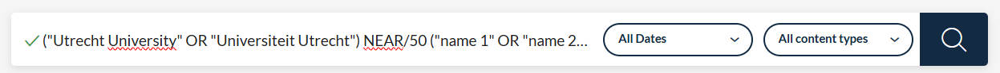
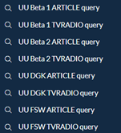
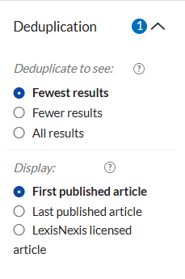
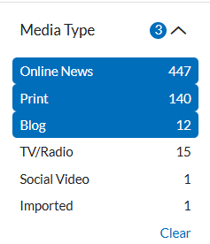
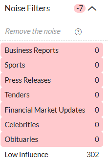
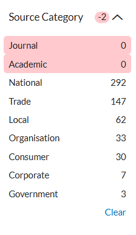
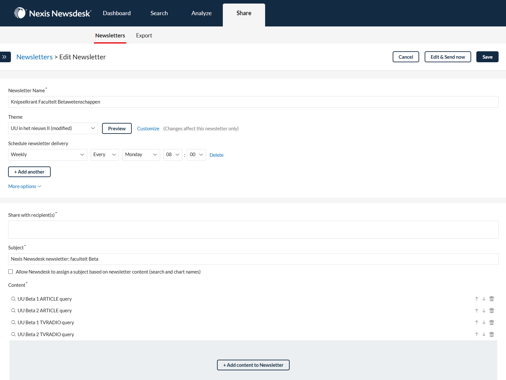
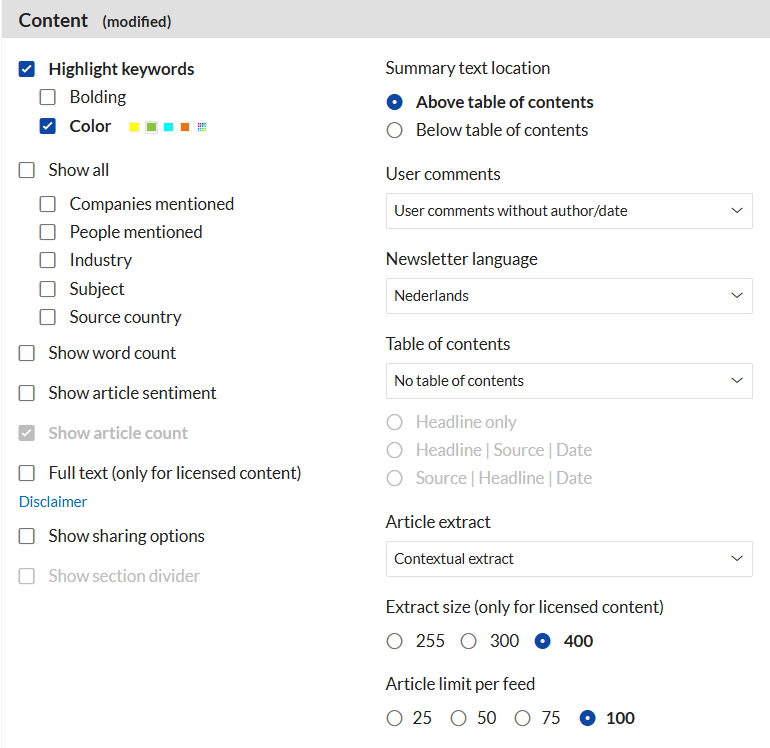
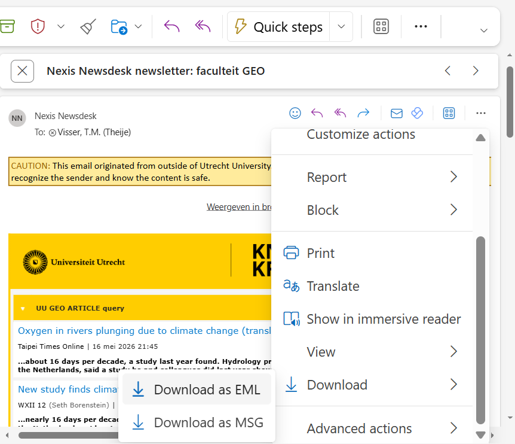

# Pure Press Clipping Processor

This guide covers installation, Pure report exports, Nexis Newsdesk newsletters,
and importing clippings into Pure. Run commands from the repository root.
The [root README](../../README.md) is the technical reference for this checkout.
The screenshots illustrate the existing newsletter workflow; interface labels
may differ in your Nexis Newsdesk or Outlook version.

## Installation

### Step 1

Clone <https://github.com/UtrechtUniversity/press_pure> and open its root
directory. Use Python 3.12 on Linux:

```bash
python3 -m venv .venv
source .venv/bin/activate
python -m pip install -r requirements.txt
mkdir -p files knipsel output logs
python -c 'import locale; print(locale.setlocale(locale.LC_TIME, "nl_NL.UTF-8"))'
```

If the locale check fails, install/enable the Dutch UTF-8 system locale using
your distribution's locale tools. The importer downloads NLTK `punkt` and
`stopwords` resources at startup. Optional PDF archiving requires WeasyPrint
system libraries; see the root README for setup details.

### Step 2

Copy `configdummy.cfg` to `config.cfg` for a new installation. For an existing
installation, merge settings into the existing config to preserve credentials.
Set `APIKEY`, `APIKEY_CRUD`, `BASEURL`, and `BASEURL_CRUD` for your own Pure
installation; both URLs need trailing slashes. Review `[NAME]`, `[FILTERS]`,
`[SOURCE_MAP]`, and `[WORKFLOW STATUS]` for your institution.

Under `[AI]`, set `AI = false` to disable AI. Otherwise configure `PROVIDER`,
`MODEL`, and the matching `OPENAI_API` or `MISTRAL_API` credential. The template
enables AI by default. Google URL search uses optional `GOOGLE_API` / `GOOGLE_CX`.

Configure `[PURE_CLIPPING]` and at least one `[PURE_ROLE:<key>]` even when AI is
disabled. Set each role's exact `URI`, `LABEL`, and `COVERAGE_TYPE`, and make
`DEFAULT_RESEARCHER_ROLE` reference a configured key. The imported keyword marker
defaults to disabled; enable it only with a supported group and classification.
Follow the [role and keyword setup](../../README.md#installation-specific-pure-roles-and-keywords)
to discover the values allowed by your Pure installation. Upload preflight checks
the configured roles and used keyword groups before any batch writes.

### Step 3

Edit `files/Filter_media.xlsx`. The first column of `Media name` contains exact
source names to exclude; the first column of `Media title` contains title
substrings to exclude. Matching is case-sensitive. A missing workbook produces
a warning and disables these exclusions.

### Step 4

Use `files/UU leerstoel report Persons CURRENT (1).json` as the basis for a Pure
person report. Adjust the Academic, Type, and Media Type filters as appropriate
for your report, then apply and save. Run the report and export the results into
`files/query.csv`, `files/query.xlsx`, or `files/query.xls`.

For CSV use UTF-8 (with or without a BOM), with commas or semicolons as delimiters.
Excel input uses the first worksheet. Supported name columns are
`Name variant > Known as name-1`, `Known as name`, or `Name`. Organisation columns
are `Organisations > Organisational unit-0`, `Organisational unit name`, or
`Alle organisational units`. Names such as `van Dijk, Jan` are converted
automatically; manual name rearrangement is unnecessary.

### Step 5

Run from the repository root:

```bash
python scripts/build_nexus_query.py
```

The script selects CSV, then XLSX, then XLS if multiple default files exist, and
warns about the ambiguity. To choose explicitly:

```bash
python scripts/build_nexus_query.py --input files/query.xlsx --output output/query_subset.txt
```

The default output is `output/queries_per_faculty.txt`. Review any
`Unmatched organisations` group before creating searches. Configure
`[QUERY] FACULTY_TERMS`, `FACULTY_PREFIXES`, and `[FACULTY_ALIASES]` for your
institution. Hierarchies split on `//`; matching is case-insensitive.

### Step 6
- Open Nexis Newsdesk
- Use the queries from `output/queries_per_faculty.txt` to create searches:



- Set the content types and dates according to the preferences of your institution
- Click the magnifying glass to search
- Click *Save changes* to save the search
- Repeat this for all your institutes, for example as follows:



- Set the filters on the left according to your preferences
- Choose *Additional filters* at the bottom to get to *Source category*
- The settings used at Utrecht University are shown below:

   

### Step 7
- After creating all queries, create the newsletters via the *Share* button and *New newsletter:*
- Add the different searches and create a separate newsletter for each faculty or institute:



- Set the layout by clicking *Customize*, choose the colour green under *Highlight keywords* and keep the other settings as shown below:



- To test: click *Edit & send now* and then *Send test*
- Set a *schedule* and add yourself as a *recipient*
- You will now automatically receive these newsletters in your mailbox at the specified time

### Step 8
- Export all sent newsletters from Outlook 365 with the extension *.eml*:



- Place all `.eml` files in `knipsel/`. The importer also accepts `.html` files.
- All subdirectories are scanned, including an `archive` subfolder. Move files
  outside `knipsel/` when they should no longer be scanned.

### Step 9
Check the configured Pure target first: this command uploads eligible clippings
to Pure and has no command-line dry-run mode. For an initial live check, use
staging credentials and keep only a small input sample under `knipsel/`.

Run from the repository root:

```bash
python scripts/knipselkrant.py
```
The importer parses clippings, matches persons, checks duplicates, writes
`output/press_clippings_*.xml`, and uploads eligible records through the Pure API.
Review `logs/press_import_*.log` for the actual upload results. XML generation
alone does not confirm upload success. `logs/processed_articles.xlsx` is
overwritten each run. Optional PDFs go under `output/pdf/`.

For an offline code check, run:

```bash
python -m unittest discover -s tests -v
```
